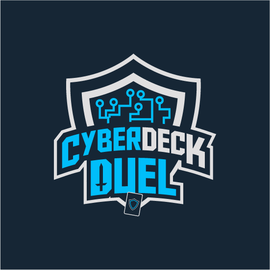

<h1 align="center">
  <br>
  <a href="#"></a>
  <br>
  CyberDeck Duel
  <br>
</h1>

<h4 align="center">CyberDeck Duel is a turn-based multiplayer strategy card game that combines Collectible Card Game (CCG) and Trading Card Game (TCG) mechanics to teach cybersecurity concepts through Game-Based Learning (GBL). Developed natively for Android, it transforms complex cybersecurity topics into engaging card battles.</h4>

<p align="center">
  <a href="#">
    
  </a>
  <a href="#">
    
  </a>
  <a href="#">
    
  </a>
  <a href="#">
    
  </a>
</p>

<p align="center">
  <a href="#key-features">Key Features</a> •
  <a href="#about-the-game">About The Game</a> •
  <a href="#how-to-play">How To Play</a> •
  <a href="#installation">Installation</a> •
  <a href="#credits">Credits</a> •
  <a href="#license">License</a>
</p>

https://github.com/user-attachments/assets/035e6c90-6423-4d3b-ac46-f7402a313e08

---

## About The Game

**CyberDeck Duel** is a final year project that brings cybersecurity education to life through an interactive, turn-based card game. Created in February 2024 and currently ongoing, this native Android application leverages **Java** and **Firebase** (for Authentication and Realtime Database) to deliver a robust Game-Based Learning (GBL) experience.

The game uniquely educates players on **Privilege Escalation techniques and mitigations** using engaging gameplay. It draws inspiration from the **MITRE ATT&CK® Matrix for Enterprise** knowledge base, ensuring the cybersecurity scenarios are relevant and accurate. By blending mechanics from Collectible Card Games (CCG) and Trading Card Games (TCG), CyberDeck Duel simulates real-world cybersecurity challenges in an accessible and fun format. Players can also track their progress through a **progression system** and analyze their strategies with **post-game analysis**.

---

## Key Features

* **Game-Based Learning (GBL):** Transforms complex cybersecurity topics, specifically Privilege Escalation, into an engaging and interactive card game.
* **Native Android Development:** Built in Java for a smooth and responsive mobile gaming experience.
* **Firebase Integration:** Utilizes Firebase Authentication for secure user management and Realtime Database for dynamic game data.
* **MITRE ATT&CK® Based:** Scenarios and cards are inspired by the renowned MITRE ATT&CK® Matrix, providing accurate and relevant cybersecurity insights.
* **CCG/TCG Mechanics:** Combines collectible and trading card game elements, where players use decks representing cyber threats, protection mechanisms, and digital assets.
* **Strategic Gameplay:** Features turn-based play where players strategically place Attack and Defense cards, each with unique power points, to outmaneuver opponents.
* **Progression System:** Unlock new cards and enhance your deck as you advance, increasing engagement and replayability.
* **Post-Game Analysis:** Review your matches to refine strategies and improve your understanding of cybersecurity concepts.

---

## How To Play

In CyberDeck Duel, each match is a strategic duel where players aim to achieve the highest total power points.

1.  **Deck & Cards:** Players start with 10 random cards from their deck, each displaying vital details: name, description, type (Attack or Defense), category, and power points.
2.  **Turns & Time Limit:** Players alternate turns, with a 2-minute time limit per turn, ensuring fast-paced gameplay.
3.  **Card Placement:**
    * **Attack Cards:** Place these in the **Attack Row**.
    * **Defense Cards:** Place these in the **Defense Row**.
4.  **Strategic Matching:** Success hinges on matching Defense cards to their corresponding Attack cards at the right time. Improper or early placement of Defense cards will render them ineffective, emphasizing critical thinking and timing.
5.  **Winning Condition:** The game continues until all cards are played. The player with the highest total power points at the end of the match wins!

---

## Installation

To get CyberDeck Duel running on your Android device:

```bash
# Clone this repository
$ git clone [https://github.com/vaynenovus12/CyberDeck_Duel.git](https://github.com/vaynenovus12/CyberDeck_Duel.git)

# Go into the project directory
$ cd CyberDeck_Duel

# Open the project in Android Studio
# Build and run the application on an Android emulator or a physical device.
```

> **Note**
> This is a native Android application. You will need Android Studio installed to build and run the project. Ensure your Android SDK is up-to-date. Firebase configuration (e.g., google-services.json) will be required to utilize authentication and database features.

## Credits

This game utilizes the following technologies and knowledge bases:

- [Java](https://www.java.com/en/)
- [Firebase](https://firebase.google.com/)
- [MITRE ATT&CK® Matrix](https://attack.mitre.org/)

## License

BSD 2-Clause license

---

> GitHub [@vaynenovus12](https://github.com/vaynenovus12) &nbsp;&middot;&nbsp;
> Twitter [@vaynenovus12](https://twitter.com/vaynenovus12)
